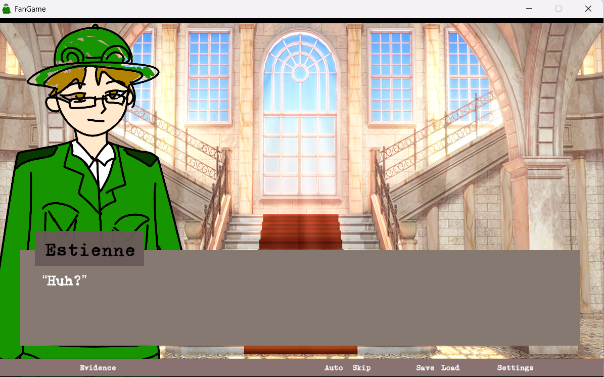
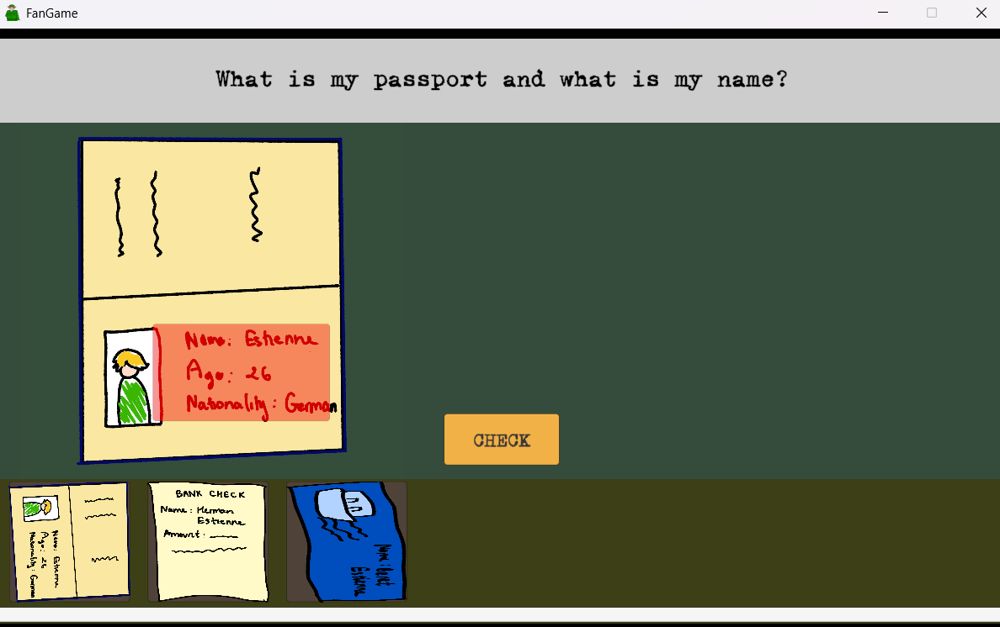
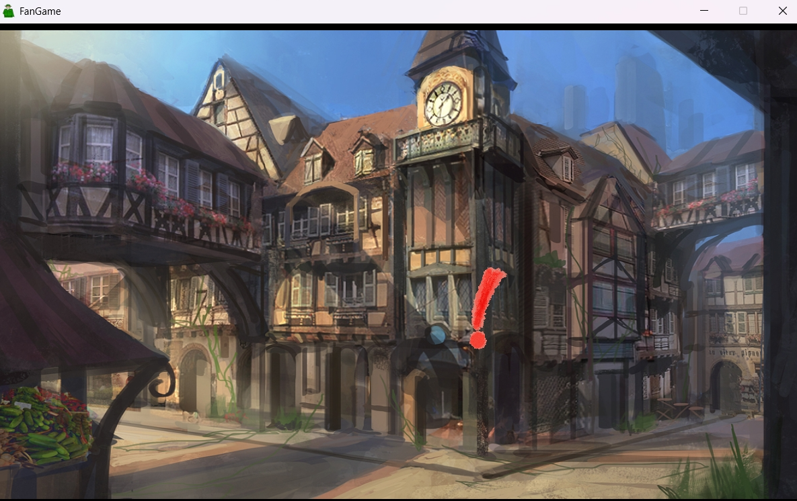

# Estienne

🎮 *A Unity-based Mystery Visual Novel*

**Status:** On Hold

## 🧩 Project Overview

Estienne is a mystery visual novel game developed in Unity, featuring a branching narrative system powered by Ink.

Password: staffercase

## 📸 Screenshots

## 🛠️ What I Did

- 🎨 UI development  
- 🧠 Developed a custom Ink script interpreter system  
  - Reads tags and manages story flow  
  - Switches between dialogue, choice, and investigation modes  
- 👤 Displays character sprites and text dynamically  
- 🔄 Implements basic scene and state transitions  

## 🚧 Future Plans

- Add Main Menu Scene
- Add save/load feature
- Fix bugs
